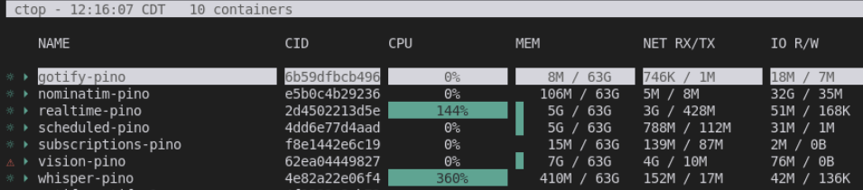
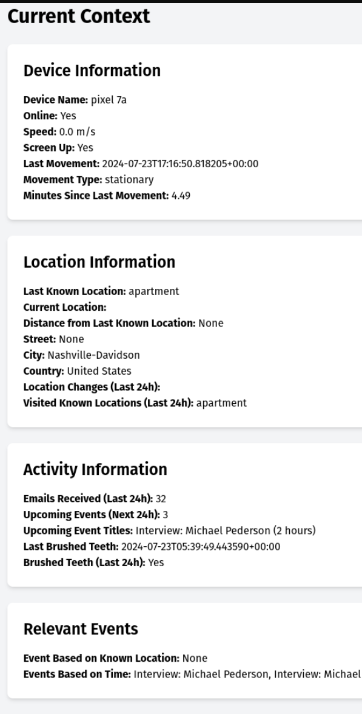

# pino - your friendly background helper agent

## Goal
An early prototype for a behind-the-scenes autonomous agent that helps the user by suggesting real-time information when appropriate. Think (consentual) behavioral modification, second-order conditioning, and subtle nudges towards desired outcomes. Pino aims to be a personal AI assistant that learns from your behavior and environment to provide timely, relevant suggestions and insights.

Key features:
- Real-time data collection and analysis from various sensors
- Contextual awareness through machine learning models
- Personalized recommendations based on user patterns and preferences
- Local-first, no cloud, no tracking

Pino is designed to seamlessly integrate into your daily life, offering gentle guidance and support to help you achieve your goals and improve your overall well-being. Whether it's reminding you to take breaks, suggesting healthier habits, or providing relevant information based on your location and activities, Pino is your friendly AI companion working quietly in the background to enhance your life experience.

**Disclaimer: This project is currently a work in progress. Many features are experimental and may not be fully functional.**

## How to Setup
1. Update Secrets in /.env
2. Update SERVER_IP in /android-app/app/src/main/assets/env
3. Setup docker compose (if needed - see [install_dependencies_popos.sh](./install_dependencies_popos.sh) if relevant to you)
  3.1. Download LLM Model - https://huggingface.co/Mozilla/Meta-Llama-3.1-8B-llamafile  into /llamafile/model/Meta-Llama-3.1-8B.Q4_0.llamafile
  3.2. [Optional] Download Different Whisper Model (place into /whisper-streaming/models/ and adjust /whisper-streaming/Dockerfile run command accordingly. Remember to remove from /.dockerignore if present!!!!)
    - https://huggingface.co/Systran/faster-distil-whisper-large-v3
      - Eg. 
4. Run `sudo docker-compose up`
5. Load initial database schema from /db/initialize_from_zero.sql

## Docker Containers
- Db - TimescaleDB for storing timeseries data
- Maps - Nominatim for geocoding
- Gotify - For easy push notifications to android/ios
- Vision/OCR -OpenedAi-vision - https://github.com/matatonic/openedai-vision
  - Example Usage: openedai-vision/chat_with_image.py
  - Server: http://0.0.0.0:5006/
  - Previously used Florence2 - (https://github.com/askaresh/MS-Florence2)
- Whisper-Streaming - (dockerized https://github.com/marcinmatys/whisper_streaming)
  - Example Usage: cd whisper_streaming/ && python3 web_app.py 
    - Hosts a UI: https://localhost:5001
  - Server: ws://127.0.0.1:43007/
- LLM Serving - LLamaFile (https://github.com/iverly/llamafile-docker running [Mozilla/Meta-Llama-3.1-8B-llamafile](https://huggingface.co/Mozilla/Meta-Llama-3.1-8B-llamafile))
  - MUST DOWNLOAD https://huggingface.co/Mozilla/Meta-Llama-3.1-8B-llamafile MANUALLY into /llamafile/model/
  - Server: http://127.0.0.1:8080/
  - underlying tech: https://github.com/Mozilla-Ocho/llamafile
  - possible replacement: SGLang - OpenAI compatible inference server (source: https://github.com/sgl-project/sglang)

## Usage after running continuously for ~8 hours

#### Dev Machine Specs for context:

## Folder Structure (Custom Docker Containers in /docker-compose.yml)
- `scheduled-injest/`
  - Scripts for periodic data ingestion (and embedding)
    - `twitter/`   scrapes likes using playwright
    - `budget/`    pull down excel file from google docs
    - `calendars/` pulls caldav from google, outlook, fastmail
    - `contacts/`  pulls down carddav
    - `email/`     pulls smtp from google, outlook, fastmail
    - `github/`    scrapes using playwright
    - `server-stats/` basic cpu/gpu/memory stats
    - `youtube/`  (tbd) download watch history, transcribe, embed

- `subscriptions/`
  - Uses a polling system with customizable intervals and notification limits
  - One step above timescaledb/postgres triggers for extracting insights from data.
  - Using it as the 'easier to debug' draft stage before I consider makign it a trigger (if possible)
  - Includes handlers for:
    - GPS data: Calculate speed, reverse geocode to get closest address (even if not a known location)
      - wip - detect if I'm at a business, etc.
    - Phone screen orientation: Detects if the phone is face up or down
    - Phone movement: Monitors if the phone is stationary
    - Archiver: pull data and create a timeseries table out of it for later analysis
    - Device connection: Monitors device online status
    - Emails: alert user via gotify when new emails come in

- `android-app/`
  - Contains the Android application for sending off data
  - Pushes:
    - audio
    - gps
    - sensors (accelerometer, gyroscope, magnetometer)
    - screenshots
  - Shows latency (each websocket packet is acknowledged by the server via a message_id)
  -  
  
- `realtime-ingest/`
  - For real-time data ingestion from Android
  - Runs some lightweight classification (audio classification)
  - Serves endpoints for correcting misclassifications
    -  
  - Serves 'frontends'
    - `/current_context`
      -  
    - `/map?start_date=2024-07-20T17:18:01&end_date=2024-07-23T17:18:01`
      -  

## Contribution

Contributions are welcome. Please refer to the issues page.

## License

This project is licensed under the CC BY-NC-SA 4.0 License. 
https://creativecommons.org/licenses/by-nc-sa/4.0/
See LICENSE.md

